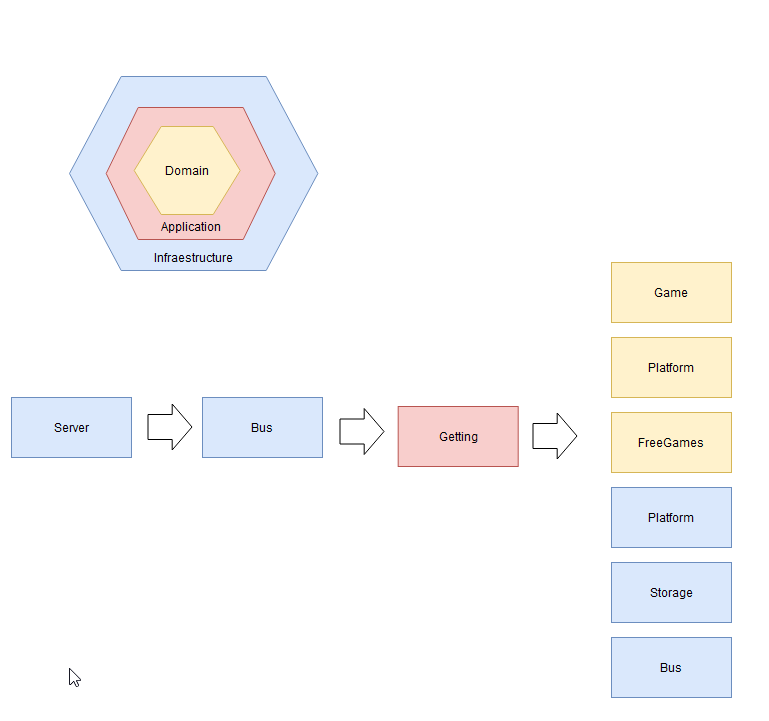

# Freegames (WIP)

This repository is a experiment in go, we'll try to create a bot that notifies of free games.

## Architecture

We will proceed to explain the architecture of the system. We don't want to be tied to any particular technology in terms of database, client or game platform, so the hexagonal architecture is going to be great for this.



### Platform

Are the gaming platforms inside the microservice, for example we have epicgames store inside to check free games for this platform.

### Repo

Repo is the main storage for this microservice, in this example we will use monodb.

## Client

For this example we will try to implement two different clients:

- Telegram
- Discord

## APP

Here is the entire business logic of the non-implementation application.

# Docker

## Execution with docker-compose

```
$ docker-compose up
```

## Execution without docker-compose

### 1. Mongo database local

```
$ docker run --name mongo -p 27017:27017 mongo:latest
```

### 2. Freegames service

```
$ docker build -t github.com/arkiant/freegames:latest .
$ docker run --name freegames github.com/arkiant/freegames:latest
```
