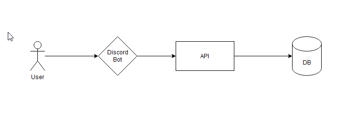

# Freegames (WIP)

This repository is an experiment in go, we'll try to create a bot that notifies of free games.

## Infrastructure



### Discord Bot

The first client connected to the API.

### API

Get all current games from these Platforms:

- Epic Games

### Database

Used for cache and not saturate the platforms used.

## API Architecture

We will proceed to explain the architecture of the system. We don't want to be tied to any particular technology in terms of database, client, or game platform, so the hexagonal architecture is going to be great for this.


### Server

Receive a Request and throw the command/query bus

### Bus

Execute the service, should be CommandBus or QueryBus:

- CommandBus used to mutate the state of the application
- QueryBus to get values

### Service

Here is the entire business logic of the non-implementation application.

This layer is responsible to create DomainEvents and throwing them to the EventBus if needed.

# Docker

## Execution with docker-compose

```
$ docker-compose up
```

## Build and execution with docker-compose

```
$ docker-compose up --build
```

## Execution without docker-compose

### 1. Mongo database local

```
$ docker run --name mongo -p 27017:27017 mongo:latest
```

### 2. Freegames service

```
$ docker build -t github.com/arkiant/freegames:latest .
$ docker run --name freegames github.com/arkiant/freegames:latest
```

### Command to update and rebuild only a single service in docker-compose

```
$ docker-compose up -d --no-deps --build <servicename>
```
